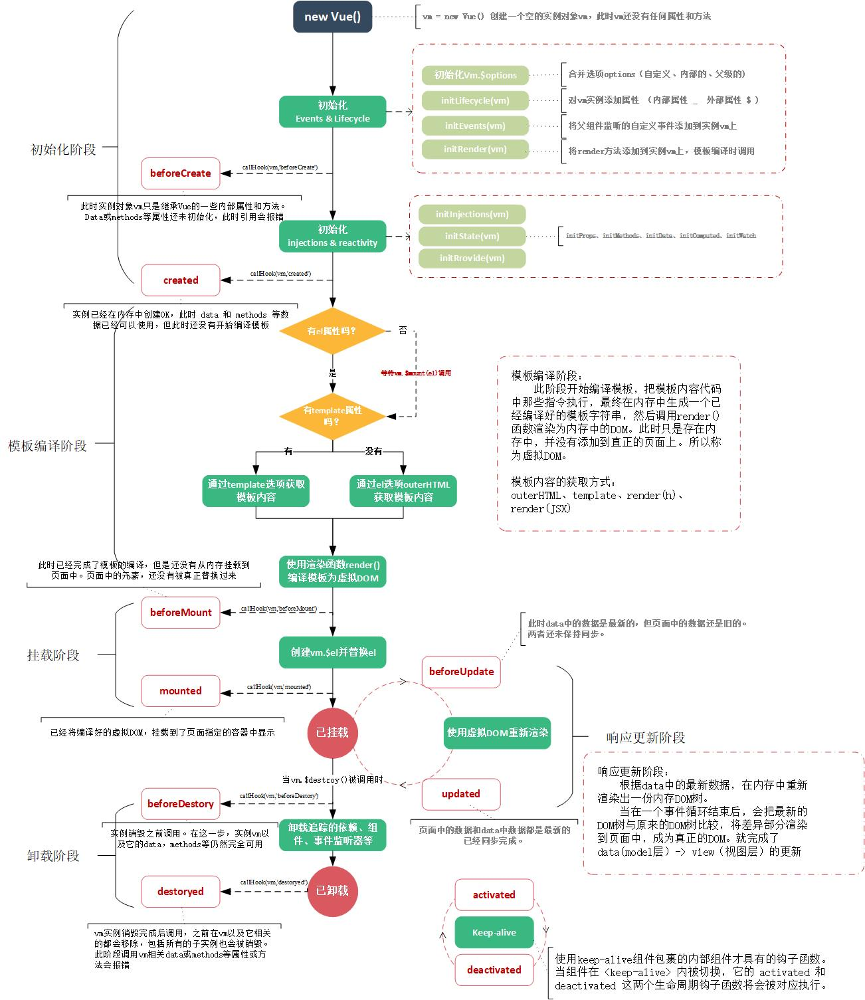

# 23 vue 生命周期钩子函数

每一个`Vue`实例在创建时都需要经过一系列初始化。根据`vue`实例化过程中执行的逻辑，可以分为5个阶段：
- 初始化阶段
- 模板编译阶段
- 虚拟`DOM`挂载阶段
- 响应更新阶段
- 卸载阶段

这个过程构成了`vue`实例的生命周期。在每个阶段前后都暴露了一个钩子函数，称为生命周期函数，可以让我们在特定阶段注入自定义的执行逻辑。

#### 下面列出每个阶段的初始逻辑

