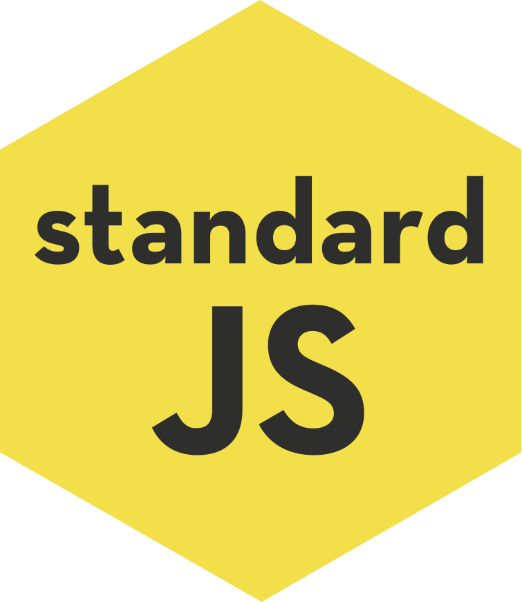

<!-- 

 -->

## WWW 万维网的发明

1989年， 当时在 CERN 工作的 Tim Berners-Lee （蒂姆·伯纳斯-李）博士写了一份关于建立一个通过网络传输超文本系统的报告，报告中阐述的这个系统包括四个部分：

- 一个用来表示超文本文档的文本格式，超文本标记语言（HTML）。
- 一个用来交换超文本文档的简单协议，超文本传输协议（HTTP）。
- 一个显示（以及编辑）超文本文档的客户端，即网络浏览器（Browser）。
- 一个用于提供可访问的文档的服务器（Server），即 httpd 的前身。

这四个部分完成于1990年底，1991年8月16日，Tim Berners-Lee 在公开的超文本新闻组上发表的文章被视为是万维网公共项目的开始。

> 这个系统在最初立项时被命名为 Mesh，但在随后的1990年项目实施期间被更名为万维网（World Wide Web）。

> httpd 一个独立运行的后台进程，它会建立一个处理请求的子进程或线程池。最早作为 Apache 服务器的主程序。

## W3C

W3C 也就是万维网联盟（World Wide Web Consortium），又称 W3C 理事会，是万维网的主要国际标准组织，是一个半自治非政府组织（quasi-autonomous non-governmental organisation）。

- 创立：由 蒂姆·伯纳斯-李（Tim Berners-Lee）于 1994年10月 于麻省理工学院 MIT 计算机科学与人工智能实验室（MIT／LCS）创立。
- 职责：W3C 制定了一系列标准并督促网络应用开发者（如浏览器厂商）和内容提供者（开发者）遵循这些标准。标准的内容包括使用语言的规范、开发中使用的规则和解释引擎的行为等等。W3C制定了包括 HTML、DOM、SVG、XML和 CSS 等的众多影响深远的标准规范。

## WHATWG

WHATWG 全称 网页超文字应用技术工作小组（Web Hypertext Application Technology Working Group）。

创立：由Web 浏览器生产厂商（主要是Opera、Mozilla基金会和苹果，后期Google也加入）和一些相关团体形成的一个的协作组织。
职责：WHATWG 的标志性规范是 HTML5规范的制定。
缘由：W3C对HTML的发展方向出现调整，大力推动XHMTL的发展，与浏览器厂商的方向不同，所以另起炉灶形成了WHATWG组织，推出HTML5规范。最终W3C回过来承认HTML5作为HTML的最新规范，W3C将与WHATWG一起合作制定最新HTML和DOM规范。

[W3C将与WHATWG合作制定最新HTML和DOM规范 ](http://www.sohu.com/a/317425124_394375) 
[HTML5的政治斗争：还要闹十年？](http://news.mydrivers.com/1/239/239149.htm)

## ECMA ECMA-262 TC39 ECMAScript Javascript

ECMA 全称 European Computer Manufacturers Association（欧洲计算机制造商协会），是一个制定计算机各种标准的非营利性国际组织，维护各种计算机相关的标准。

ECMA-262是ECMA各种标准中的第262号标准，这个标准就是ECMAScript语法标准。

TC39是ECMA下属的一个第39个技术委员会，也是由各个主流浏览器厂商的代表构成，负责制定ECMAScript标准，标准生成的流程，并推动浏览器实现。

ECMAScript：由Netscape网景公司（Mozilla的前身）将应用在Netscape浏览器上的脚本语言Javascript推荐到ECMA，并确定为标准，ECMA将其改名为ECMAScript。

Javascript：早期就是指Netscape开发的脚本语言，现在主要指ECMAScript语言在浏览器端的实现，通过浏览器提供的DOM/BOM等web API实现网页交互。

[TC39,ECMA-262,ECMAScript,Javascript,它们之间是什么关系?](https://www.zhihu.com/question/63085873)

**知识脉路**

# HTML

- html
- html5 新标签
- 语义化
- ARIA
- microdata
- 模板引擎：
    - handlebars
    - art-template
- html in js
    -JSX

# CSS

- css
- css3
- css 预处理器: scss / less / stylus / postcss
- css 框架：bootstrap
- css 架构：BEM / OOCSS / SMACSS
- Css in Js：css modules / styled components

# EcmaScript

- ES
- ES next: 6/7/8/9
- 面向对象编程
- 异步编程
- 函数式编程
- 强类型语言 TypeScript
- ES6 module
    - [前端模块化简史：浅谈 JavaScript 模块化](https://www.cnblogs.com/Leo_wl/p/4869090.html)
    - [ES modules 基本用法、模块继承、跨模块常量、import()](https://www.cnblogs.com/ChenChunChang/p/8296373.html)

# Web Browser 浏览器

- 浏览器历史
- 浏览器的多进程多线程架构:
- 浏览器网络请求：IP UDP TCP HTTP、web Socket
- Web 缓存：浏览器缓存
    - 页面资源缓存（三级缓存机制）
    - 本地数据缓存：cookie、web storage、indexedDB
- 浏览器页面渲染过程
    - 页面渲染：如何显示页面
    - V8 引擎：如何解析一段JS代码
    - JS 运行机制：如何运行一段代码
    - JS内存机制：如何进行数据存储
    - 浏览器的事件循环机制：
    [JavaScript 浏览器事件解析](https://zhuanlan.zhihu.com/p/22718822)
    [任务，微任务，队列和日程安排](https://jakearchibald.com/2015/tasks-microtasks-queues-and-schedules/)
- web 多线程：web worker、server worker(离线应用)
- 浏览器安全
    - 同源策略
    - 安全沙箱
    - 跨站脚本攻击（XSS：Cross Site Scripting）
    - 跨站请求伪造（CSRF: Cross Site Request Forgery）

[从浏览器多进程到 JS 单线程，JS 运行机制最全面的一次梳理](http://www.dailichun.com/2018/01/21/js_singlethread_eventloop.html) 
[浏览器内核、JS 引擎、页面呈现原理及其优化](https://www.zybuluo.com/yangfch3/note/671516) 
[浏览器的工作原理：新式网络浏览器幕后揭秘](https://www.html5rocks.com/zh/tutorials/internals/howbrowserswork/) 
[浏览器原理](https://github.com/lhyt/issue/issues/22) 
[关键渲染路径-刘博文](https://github.com/berwin/Blog/issues/29) 
[浏览器性能优化】优化关键渲染路径——各种对象模型（DOM，CSSOM 等）---重点是 devtools 面板使用](https://www.jianshu.com/p/dcc416bfa9c9)

#### BOM

- windows
- navigator
- location 
- history
- screen
- frames

#### DOM

- DOM0 / DOM1 / DOM3
- 框架: jQuery

#### CSSOM

- [CSS-API(CSS 编程接口),CSSOM(css 对象模型)](https://blog.csdn.net/u014711690/article/details/82346584)
- [CSSOM w3c 官方规范](https://www.w3.org/html/ig/zh/wiki/Cssom)

#### AST

# FE-Framework 前端框架
- web端： Vue  React
- 移动端：H5 React-Native Hybird混合开发
- 桌面端：PWA Electron
- 程序端附加应用： 小程序
- 跨端应用：uni-app  Taro  Flutter
[Vue 接口管理](https://www.jianshu.com/p/89ca6428a4b5)

# Build 前端工程构建

#### 构建工具
- Gulp
- Webpack
[Joyco webpack 学习笔记](https://www.cnblogs.com/joyco773/tag/webpack/)

#### 版本管理工具
- Git

#### 测试工具
- Jest

[测试概述 1：ttps://segmentfault.com/a/1190000004558796#articleHeader14](https://segmentfault.com/a/1190000004558796#articleHeader14) 
[测试概述 2：https://yq.aliyun.com/articles/610101](https://yq.aliyun.com/articles/610101)

#### 类型检查工具
- Eslint
- Typescript

#### 文档工具
- JsDoc / EsDoc
- TsDoc

# network 网络服务

- HTTP 
- Ajax 和 XMLHttpRequest(XHR)
- Fetch
- web scoket

[弄懂 CORS](https://www.jianshu.com/p/f9c21da2c661) 
[HTTP 访问控制（CORS）](https://developer.mozilla.org/zh-CN/docs/Web/HTTP/Access_control_CORS) 

# Node Server 服务器

- Node
- 框架：express -> koa -> egg

[深入浅出 Nodejs 迷你书](https://www.infoq.cn/article/nodejs) 
[正向代理和反向代理](https://uule.iteye.com/blog/2436289) 
[一个形象的比喻：谈谈正向代理与反向代理](https://cloud.tencent.com/developer/news/198489)

# 版本管理 git

[Pro git 简体中文版](https://iissnan.com/progit/) 
[易百 git 教程](https://www.yiibai.com/git/) 
[图解 git 命令](https://github.com/geeeeeeeeek/git-recipes/wiki/4.1-%E5%9B%BE%E8%A7%A3-Git-%E5%91%BD%E4%BB%A4)

# 前端分支方向

- 图形化：img -> SVG -> canvas -> webGL
- Web RTC
- Web VR
